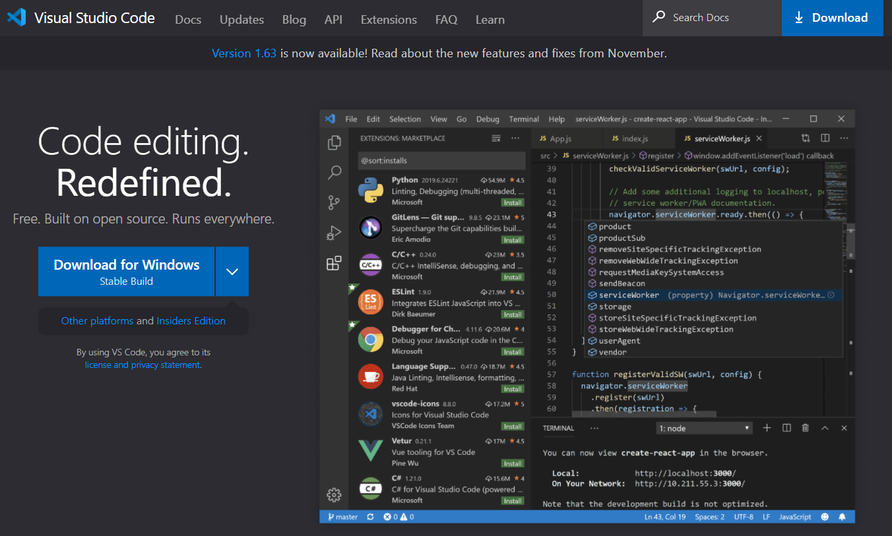
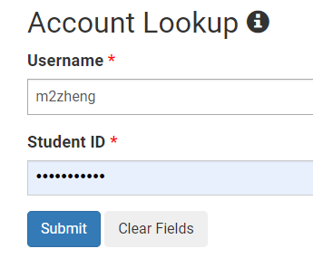
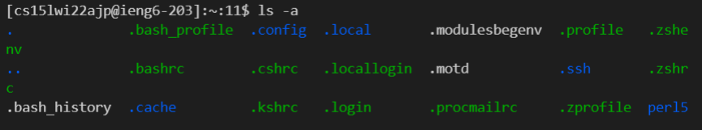
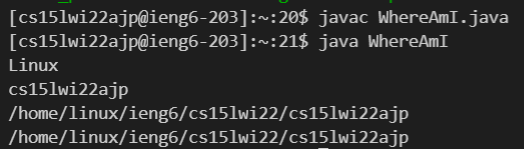
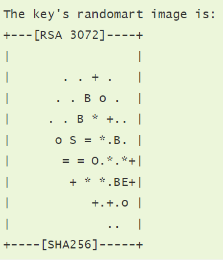
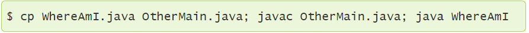

# Week 2 Lab Report: Installing and SSHing through VSCode
1. Installing VSCode 
- Navigate to [Visual Studio Code Website]( https://code.visualstudio.com/)
- Click "Download For Windows Button" 
2. Remotely Connecting
- Get account info from [ETS Website](https://sdacs.ucsd.edu/~icc/index.php)
- Open VSCode and open a new terminal
- login to remote access with following command: `ssh cs15lwi22ajp@ieng8.ucsd.edu` and enter password 
3. Trying Some Commands
- `cd` - shows current directory
- `cd - ` - shows full directory path to current directory
- `mkdir` - creates a new directory
- `ls` - lists all directories
- `ls -a` - shows all files and directories including hidden ones 
4. Moving Files over SSH with `scp`
- to move a file from current directory to remote access: `scp filename.java cs15lwi22ajp@ieng8.ucsd.edu`
- to run file, just do `javac filename.java` and `java filename` as you would do on your local machine 
5. Setting an SSH Key
- follow [steps listed here](https://docs.microsoft.com/en-us/windows-server/administration/openssh/openssh_keymanagement#user-key-generation)
- after generating key, move to .ssh/authorized_keys folder of remote access account using `scp /Users/Matt/.ssh/id_rsa.pub cs15lwi22ajp@ieng6.ucsd.edu:~/.ssh/authorized_keys`
- 
6. Optimizing Remote Running
- writing commands in double quotes ("") after ssh statement will run it on the remote server
- for example: `ssh cs15lwi22ajp@ieng6.ucsd.edu "ls"`
- writing commands between semicolons will execute them successively 
