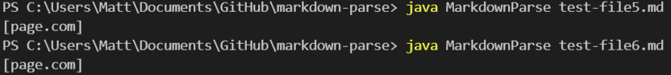
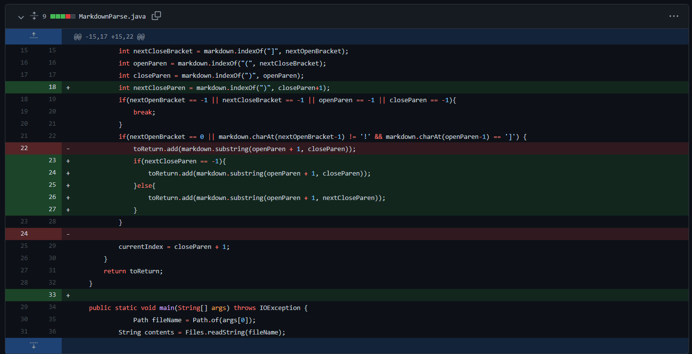

# Lab Report 2 

*Disclaimer: the test cases I used in the lab report were not the exact cases I found the failures with, I didn't remember them but many of the test files provided covered the cases that caused issues*

## 1. Infinite loop bug 

- fixed by the following change:

- caused by non-link-containing text after links [(test case that caused error)](test-file2.md)
- the infinite loop symptom is caused by a bug in how the while loop operates in MarkdownParse.java. The conditional statement controlling the while loop assumes that the closed parantheses is the last character in the .md file. Since the the largest value of `currentIndex` will always be `closeParen + 1`, if the length of the .md file is greater than `closeParen + 1` the while loop will continue indefinitely. This was addressed by adding an if statement that checks if there are any `(`, `)`, `[`, or `]` left in the .md file. 

## 2. Printing out incorrectly formatted links and image links (these two symptoms were addressed at the same time) 

- fixed by the following change (lines 22-24):

- caused by non-link containing text between `)` and `[` in the . md such as [this test case](test-file5.md) 
- image links also printed errroneously such as in [this test case](test-file6.md). 
- the symptom of erroneously printing incorrectly formatted links is due to `MarkdownParse.java` not taking into account what lies in between the indices of `]` and `(`. Since text between `]` and `(` is not checked, the substrings `[stuff]` and `(page.com)` are added, ignoring the text `paragraph` between them. To fix this bug, an if statement containing the boolean statement `markdown.charAt(openParen-1) == ']'` was implemented to check if the character preceding the `]` is a `)`.
- the symptom of erronesouly printing image is due to `MarkdownParse.java` not taking into account the case where there is a `!` character before `]`. To fix this bug, the boolean statement `nextOpenBracket == 0 || markdown.charAt(nextOpenBracket-1) != '!'` was added to check if the index of `[` was 0 or if there is no `!` preceding it. 

## 3. Single pair of nested parantheses
 \
-fixed by the following change:

-caused by nested pairs of of parantheses such as in [this test case](testFail.md)
-this symptom is caused by a bug in MarkdownParse.java as it assumes that the first `)` encountered is the end of the markdown format link. This was fixed by creating a new variable, `int nextCloseParen = markdown.indexOf(")", closeParen+1)`. In case the if statements that check if the .md file links are valid pass, another if statement checking if there is a nested `)` is executed. If `nextCloseParen != -1`, a substring from `openParen + 1` to `nextCloseParen` is added to the returned ArraList<String>
