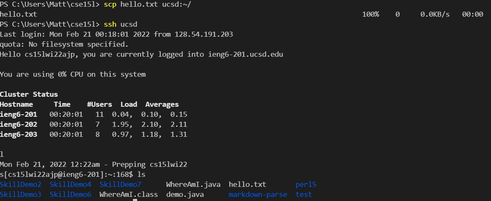

# Week 6 Lab Report 3: Task 1: Streamlining ssh configuration

## Modifying .ssh/config file 

-  changing alias from "ieng6" to "ucsd" \

## Logging into ieng6 using ssh with new alias 

## Copying a file to ieng6 using scp with new alias

