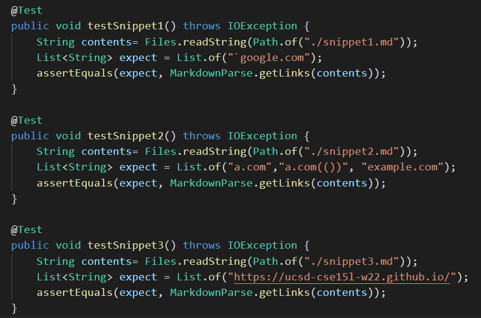
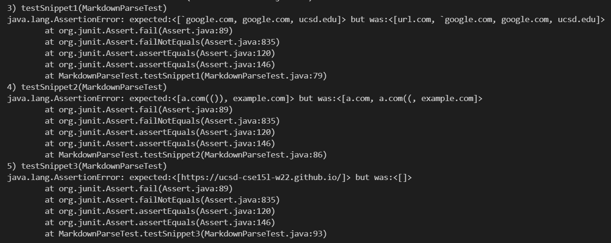
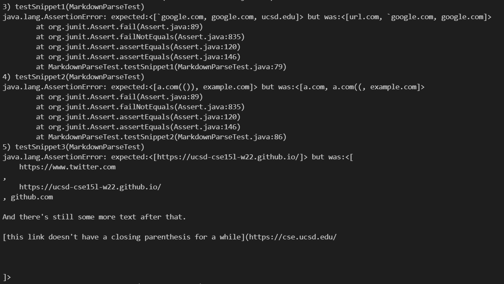

# Lab Report 4

[My group's markdown-parse](https://github.com/matty-zee/markdown-parse.git)
[The markdown-parse we reviewed](https://github.com/JessalynWang/markdown-parse)

### Expected Outputs for each Snippet
1. Snippet 1 (%60 represents the \` character) - `["%60google.com"]` 
3. Snippet 2 - `[a.com, a.com(()), example.com]`
4. Snippet 3 - `[https://www.twitter.com, https://ucsd-cse15l-w22.github.io/, https://cse.ucsd.edu/]`

### Added JUnit Tests

### Testing our implementation

### Testing the other group's implementation

## Proposed changes for snippet 1
I believe a small change can be made to account for this case where there are backticks. Since backticks  determine what is to be treated as a String in a .md file,
there should be a few lines of code that check if there is an even number of backticks between the open and closed brackets, parens, the beginning of the file and the first open parens, the closing parens and open bracket, and the closing bracket and the next link/end of file.

## Proposed changes for snippet 2
I don't think a small change can be made to account for nested loops. Having spent some time trying to fix this issue on my own, I think the best way to approach this would be a recursive helper method.
In this recursive helper method, we would use recursion to identify the indices of the outermost pair of parantheses. Then, we would need to add additional code to the getLinks method
in order to all the parens and whatever is between the outermost pair. 

## Proposed changes for snippet 3
I think a small change can be made to account for cases where there are newline characters. We could use `String.replace()` to replace `\n` with an empty String for text between the parens and brackets. 
Doing so would get rid of any line breaks that would cause the code to invalidate a link. 
