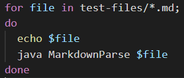
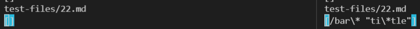
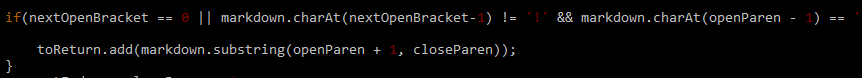
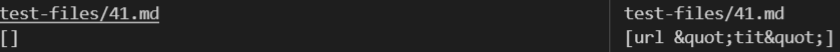

## Lab Report 5

In order to find the difference between two files, I made the following modification to the bash script: 
 \
This prints the test file name before the output for that test. I ran this bash script and saved the ouput to a text
file and compared them side by side to spot differences for tests. 

### Difference 1: 
 \
The output of my implementation is shown on the right. 

According to commonmark preview, the expected output should be `[ti*tle]`. This means neither of the implementations are correct.
I believe the reason for this is that my implementation does not check for text between double quotes, which is the text that appears as the link. 
In order to do this, we would have to add a two new int variables that keep track of open and closed parens. The following if-statement would need to be modified 
to incorporate the new int variables to determine what substring gets added to the returned list. 

## Difference 2:
 \
The output of my implementation is shown on the right.

According to commonmark preview, the expected output should be `[]`. This means my implementation is incorrect. 
I believe the reason for this is that my implementation does not check for spaces. Spaces between the open and closing parenthases invalidates the link.
To do this, I would use `String.contains(" ")`.
 \ 
Inside this if statement, I would add an if statement that looks something like 
`if(markdown.substring(openParen + 1, closeParen).contains(" "))
  break;`
 That way, if the substring between the parenthases contains a space, no link is added to the return list. 
